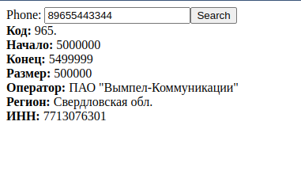
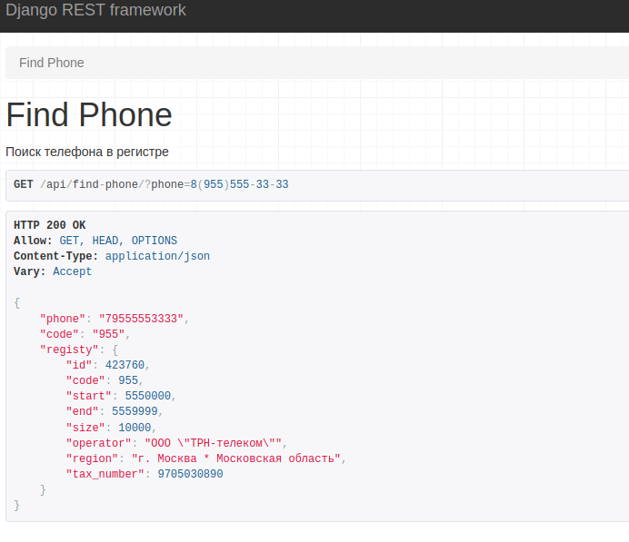
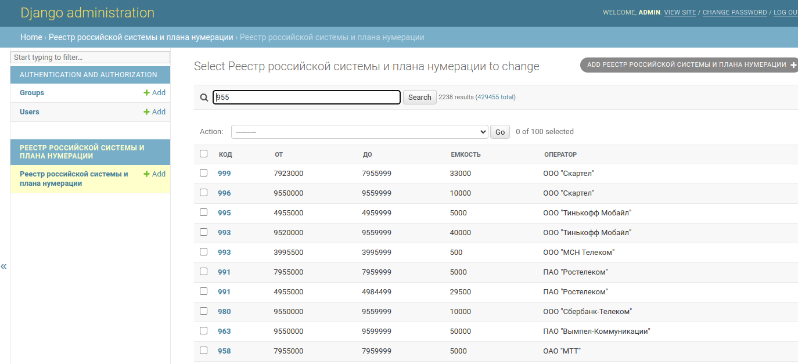

# Реестр российской системы и плана нумерации в удобном виде
Моя древная любовь к телефонии. См также [open_mcc_mnc](https://github.com/saintbyte/open_mcc_mnc)

Сам проект занимает тем что тянет данные с https://opendata.digital.gov.ru/registry/numeric/downloads/ и
сохранает в базу, а потом по номеру можно определить оператора

### Деплои:
1. ```git pull``` 
2. ```pip install -r requirements.txt```
3. Настроить по примеру из .env-example в файле .env ваше подключение к базе postgres
4. ```./manage.py migrate``` 
5. ```./manage.py makemigrations ```
6. ```./manage.py migrate``` 
7. ```./manage.py createsuperuser``` 
8. ```./manage.py download_from_opendata```
9. Открыть браузер http://localhost:8000

### Обновление
Запустить: 
```./manage.py download_from_opendata```
Если в процессе произойдут ошибки база останется старой. 
### Внутри: 
 * форма

 

 * api

 

 * админка

 